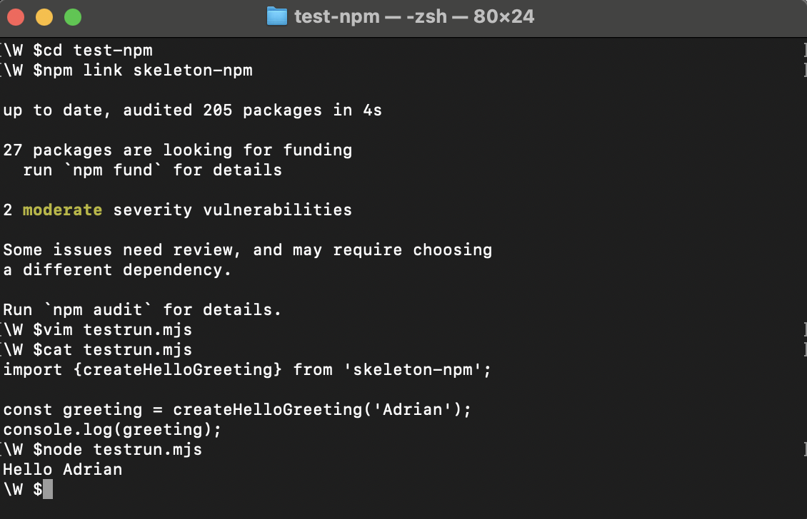
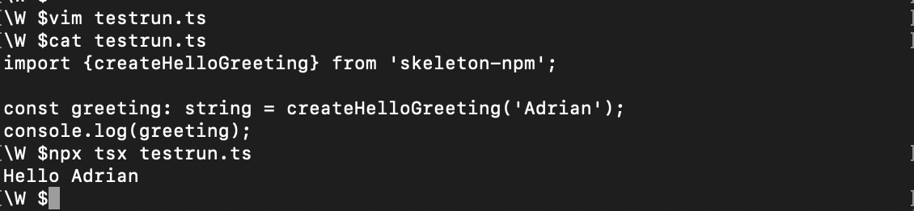
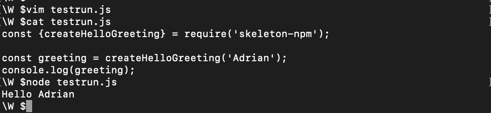
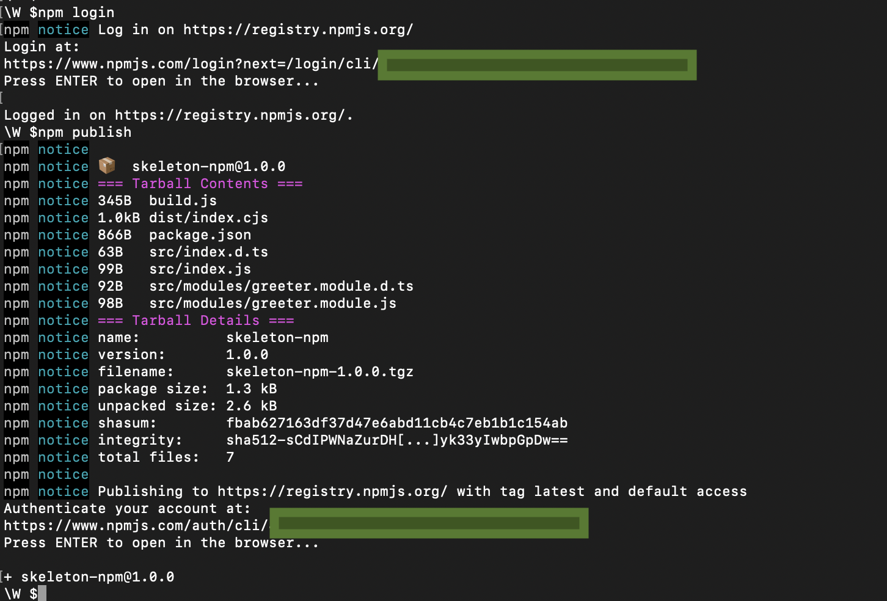

# Publishing an npm package with Typescript, ES6, and CommonJS support

This project serves two purposes:

1. Demonstrate how to publish an npm package that can support CommonJS, ES6, or Typescript based projects
2. The `code` serves as a project template that can be used as starting point for an npm package. Feel free to fork or clonse this project as starting point of a new npm package.

## Publishing the npm package

For this project, the npm package will export a function that takes a name and returns `Hello name`. The package, which is directory `code`, will have a final src structure that is scalable to support multiple modules.

```
├── src
│   ├── modules
│   │   ├── *.module.js
|   |   ├── *.module.d.ts
│   ├── index.js
|   ├── index.d.ts
├── build.js
├── package.json
```

The files with suffix `.d.ts` are the typescript definitions that will allow support for Typescript. Read more about it in the Typescript section below.

### Prerequisites

1. This project was created using `npm 10.2.5` and `node v18.18.0`.
2. The global `node_modules` should be created where write permission is available.

## Part 1: Writing the base code to support the three different approaches

### Creating the base to support ES6

1. Create a directory called `skeleton-npm` (or any other name). Initialize the project using npm to create the project structure with default configuration

```
npm init -y
```

This should have generated a file called `package.json`

2. Specify the npm package type as `module`. This will look like the following in the package.json as follows:

```
{
    \\other properties removed for brevity
    "type": "module"
}
```

3. Create directory named `src` and inside create another directory called `modules`. This structure demonstrates a modular way to expand the constructs (e.g. function, class) that can be exported by this package.

4. Inside `modules` directory create a file called `greeter.module.js`. Inside, type the following

```
function createHelloGreeting(name){
    return `Hello ${name}`;
}

export { createHelloGreeting };
```

The `export` keyword is used export to make functions, objects, or variables available for use in other files or modules;

5. In `src` create an index.js file and export the contents of `greeter.module.js`:

```
import { createHelloGreeting } from './modules/greeter.module.js';

export { createHelloGreeting };
```

#### Testing the ES6 compatibility of the package

1. To test the package locally, execute the `npm link` command in the directory containing the package. This command creates a symbolic link from the global `node_modules` that points to the package currently being implemented.

2. Create a new directory (e.g. `mkdir ~/.test-skeleton-npm`). Go in the directory and execute `npm link skeleton-npm` assuming the name of the package created is `skeleton-npm`. The command links the testing project to `skeleton-npm`.

3. In root of test directory, create an `testrun.mjs` file and import the library using ES6 syntax:

```
\\inside <test-directory>\testrun.js
import {createHelloGreeting} from 'skeleton-npm';

const greeting = createHelloGreeting('Adrian');
console.log(greeting); 
```

4. Execute `node testrun.mjs`. With above code, this should print `Hello Adrian`. 



##### Note for testing ES6 support

NodeJS will use ES6 module mechansim if the Javascript file has a suffix `.mjs`. We can achieve the same testing without using this suffix (just `.js`) by initializing the test directory with command `npm init -y` and specify the type property as `module`. 

### Adding Typescript support

To support Typescript, we can take advantage of typescript definitions. Definitions provide type information about entities in JavaScript code. They are used by the TypeScript compiler to understand the shape of JavaScript libraries and enable type-checking when using those libraries in TypeScript projects.

1. Create definition files `.d.ts` for all exporting `.js`files

```
//greeter.module.d.ts
declare function createHelloGreeting(html: string): string;

export { createHelloGreeting };
```

```
//index.d.ts
export { createHelloGreeting } from './modules/greeter.module';
```

2. Specify the definitions entry point in npm package definition

```
//package.json. Other properties removed for brevity
{
    "types": "src/index.d.ts"
}
```

Mentioning the types is optional but mentioning it in the package's package.json helps TypeScript locate and use the associated TypeScript definition file (.d.ts) for your package. The following are its benefits:

* Automatic Type Inference, Type Checking, and IntelliSense Support.

* Simplified Usage - Specifying the types field in your package's package.json simplifies the process for TypeScript users by providing a direct path to the type definitions. Users don't need to manually configure TypeScript paths or search for type definitions in the node_modules directory.

#### Testing the Typescript support of the package

1. Go the testing dfirectory created when testing the ES6 support then install the Typescript execute package: `npm i tsx`

2. Create a typescript file named `testrun.ts` with the following typescript code

```
import {createHelloGreeting} from 'skeleton-npm';

const greeting: string = createHelloGreeting('Adrian');
console.log(greeting); 
```

3. Execute the typescript code using: `npx tsx testrun.ts`



### Adding CommonJS support

CommonJS is a project to standardize the module ecosystem for JavaScript outside of web browsers. CommonJS's specification of how modules should work is widely used today for server-side JavaScript with Node.js. However, as of this writing, nowadays, the preferred way of creating packages is to use ES6 compliant modules.

Since for this project we have set the package type as module, by default, the package follows the ES6 module system. In order for this package maintain support for CommonJS, transpilation must happen prior to publishing. For this package, `esbuild` is used for transpilation and bundling of CommonJS equivalent code:

1. Install `esbuild`: `npm i --save-dev esbuild`
2. Install `esbuild-plugin-clean` which will provide additional capability of deleting the old transpiled bundle prior to creation of new one: `npm i --save-dev esbuild-plugin-clean`
3. Write a build script to execute and use the esbuild clean plugin:

```
import { build } from 'esbuild';
import { clean } from 'esbuild-plugin-clean';

await build({
  entryPoints: ['./src/index.js'],
  bundle: true,
  format: 'cjs',
  outfile: './dist/index.cjs',
  plugins: [
    clean({
      patterns: ['./dist/*']
    }),
  ],
});
```

Write this code in the root directory of the package and name this as `build.js`. This script will bundle the ES6 compliant JS codes into one bundle file called `index.cjs` under the `dist` directory in the root directory. The suffix `.cjs` tells nodejs that this is a Javascript file following the CommonJS system and is the one to be linked when imported by the users of this package using CommonJS system. The clean plugin removes the old `dist` folder prior to the creation of the bundle file.

4. Modify the package.json file by providing a new value for property called `exports`:

```
{
    //other properties of package.json are removed for brevity
    "exports": {
      "import": "./src/index.js",
      "require": "./dist/index.cjs"
    }
}
```

By specifying this specific property value, the package is able to tell how to expose the functionality using the ES6 module system (`import`) or CommonJS(`require`).

5. Execute the transpilation of the CommonJS equivalent module in `preinstall` phase by adding a script in the package.json:

```
{
    //other properties of package.json are removed for brevity
    "scripts": {
      "preinstall": "node build.js"
    }
}
```

This will execute the esbuild transpilation setup under `build.js` during preinstall which is executed prior to publishing of the package in the remote npm repo.

#### Testing the CommonJS support of the package

1. Go to the testing directory and create a file named `testrun.js` with the following CommonJS code

```
const {createHelloGreeting} = require('skeleton-npm');

const greeting = createHelloGreeting('Adrian');
console.log(greeting); 
```


2. Execute the above using `node testrun.js`



By default NodeJS will use CommonJS as its module system unless a package.json is present with type `module`

## Part 2: Publishing the application

After completing the package's functionality, the package can now pe published. Follow the following steps:

1. Login to the remote node server using the following command. By default this will be npmjs.com:

```
npm login
```

This will open a browser session with npmjs. An account will be required if not yet existing. Follow the steps and complete the login

2. After credentials have been verified, publish the package

```
npm publish
```

Nowadays, OTP is required when publishing to npm. When required a re-login using the OTP setup will be required to authenticate prior to publishing



See the published package at https://www.npmjs.com/package/skeleton-npm